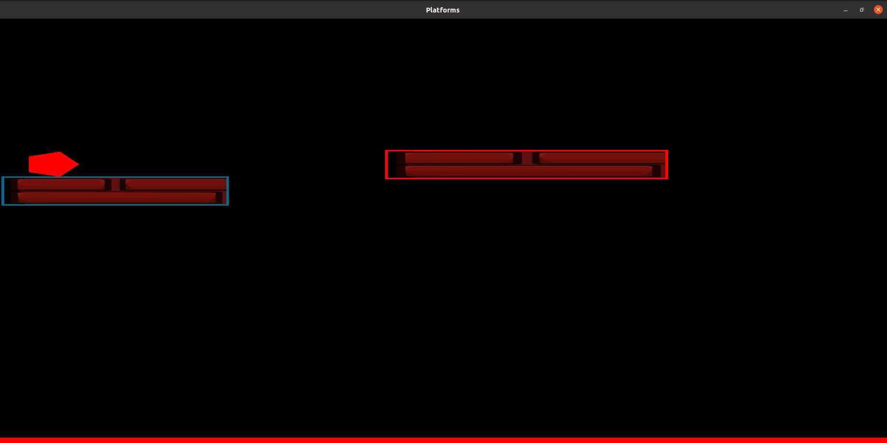
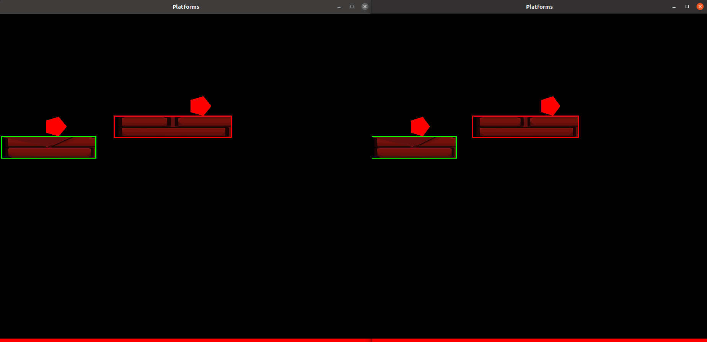
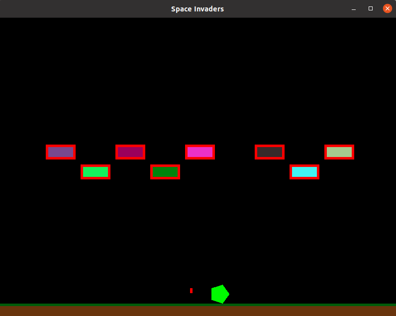
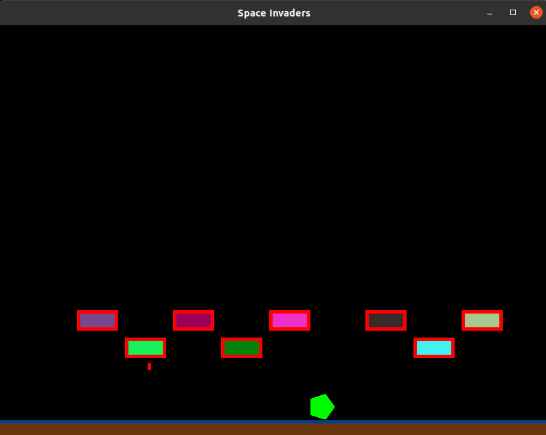
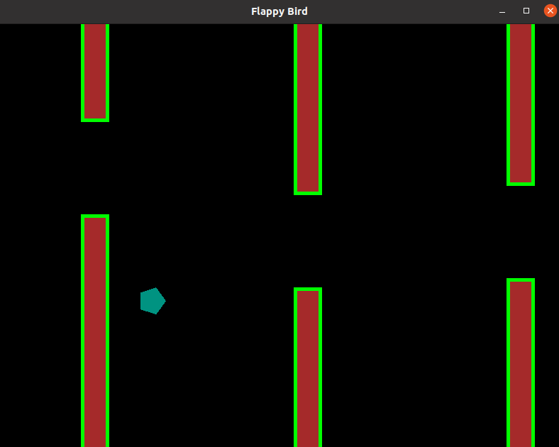

# Platformer Game Engine

## Project Overview
This project, developed for the Game-Engine-Foundations course (CSC581), is a platformer game engine with incorporated features such as movement, basic physics, inheritance, reusing, asynchronity, networking (multiplayer), scripting, and event management. The game engine showcases its capabilities through two implemented games, namely Flappy Bird and Space Invaders.

## Controls
- **A:** Move Left
- **D:** Move Right
- **Space:** Jump
- **E + Resize Button on Title Bar:** Constant Scaling
- **Q:** Change Speed (0.5x, 1x, 2x)
- **P:** Pause/Unpause
- **R:** Record and Play Replay. Pressing 'R' starts recording, and pressing it again stops recording and plays the recording.
- **A & D (Chord):** Death Script

## How to Run
1. Download the zip and extract it.
2. Open a terminal and navigate to the extracted folder.
3. Install the required dependencies and libraries.
4. To start the server:
    ```bash
    cd server
    g++ -c game_server.cpp -
    g++ game_server.o -o <output_file_name> -lsfml-graphics -lsfml-system -lsfml-window -lzmq
    ./<output_file_name>
    ```
5. To start the client:
    ```bash
    make
    ./main
    ```

## System Specifications
- **Operating System:**
  - Ubuntu 20.04 (tested)
  - Should work on Windows, macOS, and other versions of Linux (not tested)

## Images






-**Game Engine**
[](assets/6.mp4)
[](assets/7.mp4)
[](assets/8.mp4)

## Dependencies
1. x11-apps
2. build-essential
3. libsfml-dev
4. zmq
5. v8

## Author and Acknowledgement
**Author:** Madhur Dixit

## Project Status
Completed


